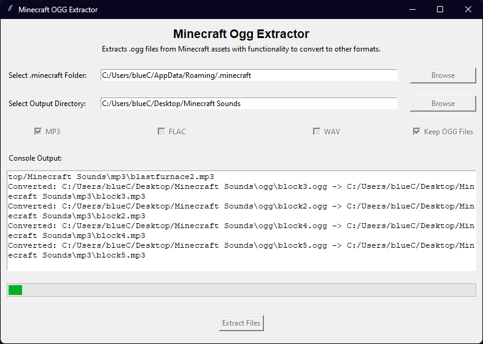

# Minecraft OGG Extractor

Minecraft OGG Extractor is a tool to extract `.ogg` audio files from Minecraft's game assets for 1.8 or above with extra functionality to convert to other audio formats such as MP3, FLAC, and WAV if desired.

## Features
- Extracts ogg files from Minecraft assets.
- Convertion options for MP3, FLAC, and WAV formats.
- Option to keep or delete the original .ogg files after conversion if desired.
- Simple auto-scrolling console log and progress bar for extraction/conversion.
- User-friendly tooltips for guidance.



## Information - How it works
All audio files for Minecraft versions 1.8~ and later have been "hidden" and hashed as entries within a .json file inside the `.minecraft/assets/indexes` folder.

Here's an example from one of these `.json` files:
```bash
"minecraft/sounds/music/game/ancestry.ogg": {"hash": "868c7a7c4d9358d631fa2f9abfc6bbf05d88292d}",
```

The corresponding files for these hashes can be found within the `.minecraft/assets/objects/..` folders

This application automates the extraction of audio files from Minecraft's game assets. It parses .json files to retrieve all hash values associated with .ogg files, locates these files in corresponding sub-folders within Minecraft's asset directory (assets/objects), and copies them to a specified output directory. During this process, each file is renamed from its hash value to its original audio name and file extension.

<b>Note: As of time of push, this application will try to automatically use the highest numbered .json file within the indexes folder (16.json/17.json) - Utilize the issues section of this resository to report bugs.</b>

## Requirements
- Python 3.6 or higher
- Required Python packages (see `requirements.txt`)

## How to use

- First, download the `minecraftoggextractor.exe` from the releases section of this repository and run it.

- Once open, you can begin filling out the required fields, such as your `.minecraft` directory and the desired `output directory`.

- Next, select your desired file formats by checking one or more of the format checkboxes (MP3, FLAC, WAV, Keep Ogg Files). 

- When you are ready, simply just hit the `extract files` button

Please note that ogg files will be initially extracted regardless of whether `keep ogg files` is checked or not. This checkbox only serves to preserve them alongside alternative formats if specified.


## How to build

Download

1. Clone the repository or download the source code.

2. Install the required packages using pip:
   ```bash 
   pip install -r requirements.txt
3. Run main.py
   ```bash
   python main.py
## How to Compile

1. Ensure `pyinstaller` is installed.
2. Run inside repo directory.
   ```bash
   pyinstaller --onefile minecraftoggextractor.py
3. `exe` will be in the generated newly created `dist` folder in the cloned repo's directory.

# Disclaimer / Terms of Use
- This application is provided "as is", without warranty of any kind, express or implied.
- The author is not liable for any damages or legal issues arising from the distribution of files extracted using this software.
- This software is only intended for use by individuals who have purchased Minecraft Java Edition. Please respect the rights of the game developers and comply with all relevant laws and terms of service.